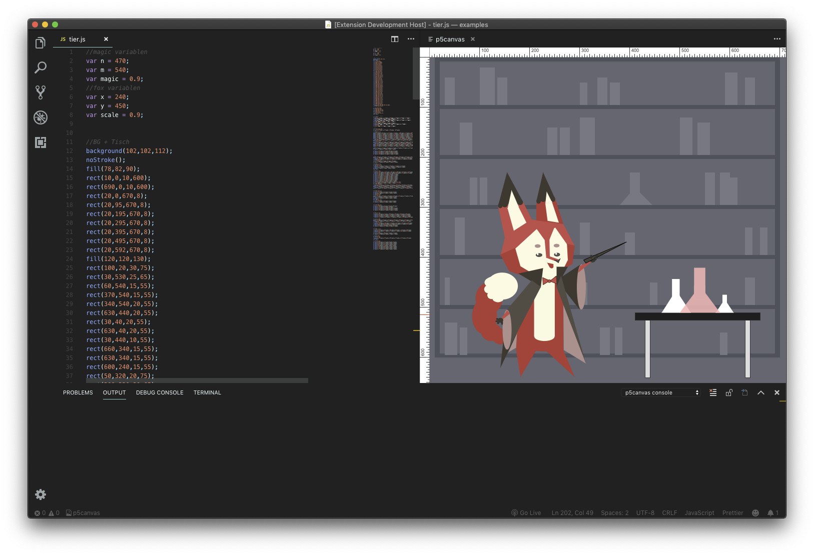

# p5canvas README

The p5canvas extensions allows you to preview your p5js code in a canvas side by side with your code. The canvas refreshes live, while editing.

## Features

- Side Preview while editing the JavaScript file
- JSHint integration to find errors

## Usage

If a JavaScript file is open, a p5canvas button appears in the status bar bottom left. Click on it, to open the preview.

## Known Issues

There are currently no known issues. If you find any issues, please feel free, to message me on [Twitter](https://twitter.com/pixelkind) or [Github](https://github.com/pixelkind/p5canvas).

## Release Notes

### 1.0.0

Initial release of p5canvas.

## License

This Library is licensed under the MIT License. Please refer to the `LICENSE.txt` for more information.
